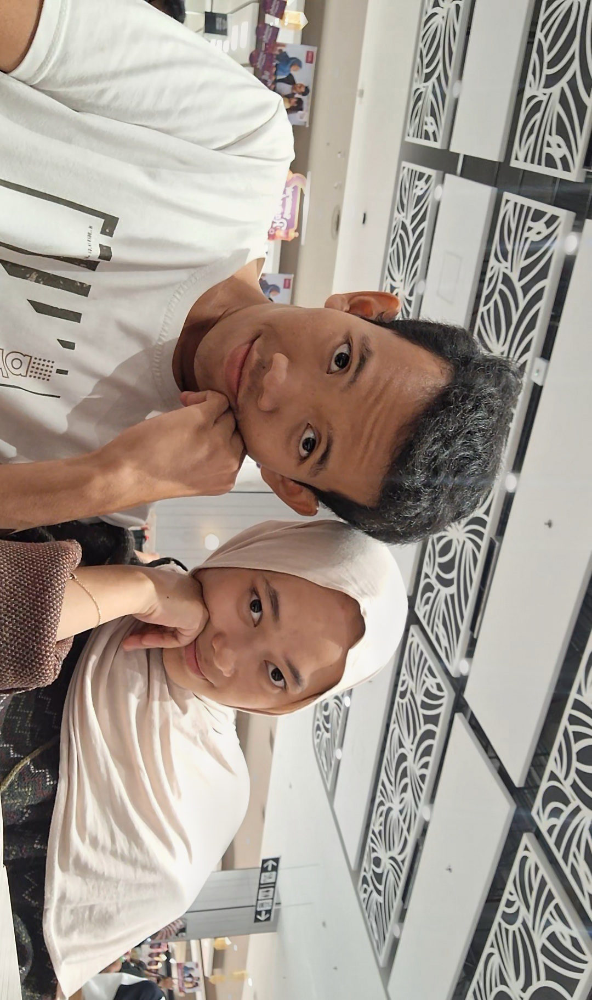

# ulangtahun-pacrr<!DOCTYPE html>
<html lang="id">
<head>
<meta charset="UTF-8">
<title>Happy Birthday 💖</title>

</head>

<body>

<button id="openBtn" onclick="start()">Klik aku 💖</button>

  <h1>Happy Birthday Sayanggggg 💖</h1>

  

    
    
    
    
  

  

<audio id="music" autoplay loop>
  <source src="https://www.bensound.com/bensound-music/bensound-romantic.mp3">
</audio>

</body>
</html>
